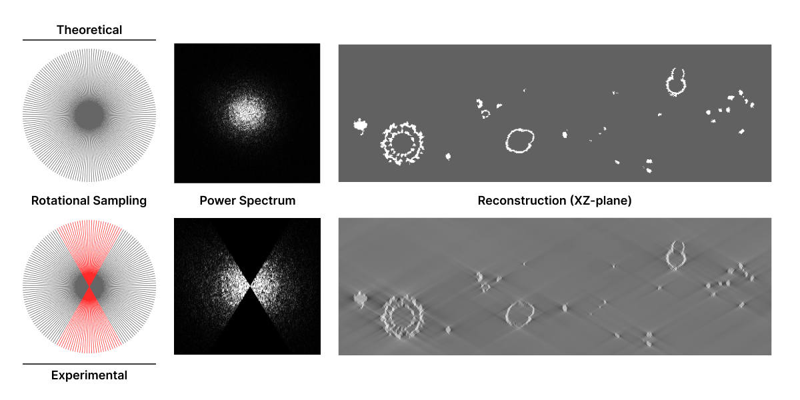

(cryoet-ctf)=
# CryoET Image Processing Challenges

## Overview

Cryo-electron tomography (cryoET) reconstructs 3D volumes, or tomograms, using rotational 2D projections from a sample.
In an ideal scenario, each 2D image in a tilt series would represent a true projection of a 3D sample. However, in
reality, tomogram reconstructions are based on blurred sample images due to microscope limitations, image acquisition
settings, and electron scattering that result in missing, attenuated, or inverted components of true images. This
blurring has to be taken into account during image processing to optimize tomogram resolution. Here we discuss major
challenges that affect tomogram resolution and analysis, including noisy data, contrast transfer function (CTF), and the
tilt angle limitation (“wedge problem”). To provide context for the limitations and their solutions, we'll first
describe how images are processed.

## Image Processing: Fourier Space

Researchers transform 2D images into their frequency domain representation using Fourier transforms to enable efficient
tomogram reconstruction. Think of an image as a mixture of lots of different patterns – some big and blurry (low
resolution), some small and sharp (high resolution). A Fourier transform is a mathematical process that can break down
exactly which patterns are present in the image and how strong each one is. These patterns are represented as a
combination of different waves, where each wave component describes a particular pattern or level of detail in the image
based on their magnitude (strength) and spatial frequency. This information is stored in Fourier space, a representation
of the image based on wave patterns. Importantly, researchers can easily convert between Real and Fourier space. Fourier
components can be visualized using a power spectrum plot, which depicts the magnitude of each spatial frequency
component.

<figure>
  
  <figcaption style="width:75%;"><b>Figure 1</b>: SARS-CoV-2 virus particle image followed by Fourier transform (FT)
  illustrated as a power spectrum and resulting image after inverse FT. Researchers use FT to decompose images into
  their frequency components (sine waves) and inverse FT to recombine them and reconstruct the original image. The FT
  can be plotted as a function of magnitude and spatial frequency or power spectrum. Each pixel in the power spectrum
  represents one of the frequencies or Fourier components present in the image. The panel underneath the power spectrum
  highlights different resolutions. Fourier components near the outer edge of the power spectrum represent
  high-resolution components of the image (highlighted in yellow) and those near the origin represent low-resolution
  features (highlighted in red). Low-magnitude components appear dark, and high-magnitude components appear bright. The
  example SARS-CoV2 virus particle image was retrieved from the CryoET Data Portal (run
  <a href="https://cryoetdataportal.czscience.com/runs/469">RN-469</a>); publication
  <a href="https://doi.org/10.1038/s41586-020-2665-2">Ke, Z., et al. 2020</a>.
  </figcaption>
</figure>

Researchers can take advantage of the Fourier space to manipulate Fourier components that affect the quality of 2D
projected images. For example, if you know that most of the "graininess" on an image is made up of tiny white dots of a
certain size, you can design a filter that's really good at removing those specific dots without affecting the actual
image too much. Filters can be applied in Fourier space to highlight or remove certain frequency components in the
image. Low-pass filters let low-resolution components through and filter out high-resolution image components.
Conversely, high-pass filters let high-resolution components through but filter out low-resolution components.
Band-filters only retain frequency components within a specified range.

<figure>
  
  <figcaption style="width:75%;"><b>Figure 2</b>: Projection images, power spectra and 3D maps of the human ribosome
  (<a href="https://www.rcsb.org/structure/6QZP">PDB:6QZP</a>) with different Fourier space filters applied. Researchers
  can apply filters in Fourier space to adjust the spatial frequency component content of an image. Low-pass filters let
  low-resolution components through (top right), while high-pass filters select for high-resolution components (bottom
  left). Band filters only retain components within a specified threshold (bottom right). Band pass filtering was
  performed with <a href="https://github.com/teamtomo/torch-fourier-filter">torch-fourier-filter</a>. Ribosome maps were
  rendered using <a href="https://www.cgl.ucsf.edu/chimerax/">ChimeraX</a>.
  </figcaption>
</figure>

Fourier space enables a number of operations that would be difficult in Real space. Two-dimensional projections obtained
through cryo-electron microscopy do not include all the Fourier components that represent true density distributions in
the sample due to noise, contrast transfer function, and missing data challenges discussed below. Researchers take
advantage of image processing in Fourier space to improve 2D images and, ultimately, tomogram reconstruction despite
these limitations.

## Noise

CryoET data is inherently noisy. Noise limits the ability to resolve fine tomogram details and can obscure real features
in the image, making it difficult to accurately interpret reconstructed structures. Additionally, noise can negatively
impact downstream analysis steps, such as segmentation, particle picking and subtomogram averaging.

Noise is introduced during image acquisition and processing. Major sources of noise introduced during image acquisition
include:

* Sample quality: Imperfections in the vitreous ice embedding of the sample (e.g., contamination) can affect the
  electron microscope signal and introduce noise.
* Sample heterogeneity: Data variability due to complex sample composition can contribute to noise in the reconstruction.
* Weak signal: Low electron doses are used to minimize radiation damage to samples. However, these low electron doses
  result in a weak signal carrying information about the sample. This weak signal is often overwhelmed by noise
  resulting in a low signal-to-noise ratio (SNR).
* Electron scattering: When the electron beam interacts with the sample, electrons are scattered. Elastically scattered
  electrons retain their energy and provide structural information, whereas inelastically scattered electrons lose
  energy and introduce random noise. In cryoET, energy filters are used to record elastically scattered electrons but
  the filters are not perfect and allow some inelastically scattered electrons to pass through.
* Radiation damage: Despite low electron doses, radiation damage occurs since total electron beam exposure increases
  over the course of imaging the sample at various tilt angles. This damage contributes to noise.
* Detector noise: The detectors used to capture the electron signal have inherent noise due to electronic noise,
  variations in pixel sensitivity, and other factors.

Computational methods used to process acquired images and reconstruct the sample 3D volume from 2D projections can also
introduce artifacts and noise. This noise can result from limitations in the algorithms or inaccuracies in the tilt
series alignment due to differences between individual image projections.

### Addressing Noise

Researchers can model noise to remove it from final images. Some of the noise introduced during image acquisition has a
statistical distribution that resembles a Gaussian distribution  having equal power at all frequencies (“white noise”).
This type of noise can be mathematically described to distinguish between real signal (the actual structure of interest)
and random fluctuations caused by noise. However, not all noise is white noise. Some noise, known as colored noise, has
a complex frequency-dependent power spectrum that is hard to model. Researchers are now implementing machine learning
(ML) methods to learn complex noise patterns directly from acquired images and remove them. Below we describe DenoisET,
a tool developed by the Chan Zuckerberg Imaging Institute (CZII), to illustrate the application of ML for noise
reduction in tomogram reconstructions.

[DenoisET](https://github.com/apeck12/denoiset) is a noise reduction software that leverages an unsupervised
convolutional neural network (CNN) known as [Noise2Noise](https://github.com/NVlabs/noise2noise). Noise2Noise does not
need clean data for training purposes because it “learns to turn bad images into good images by only looking at bad
images”. The premise of Noise2Noise is that noisy images have the same underlying clean image but with different noise
patterns. The average of noisy images should approximate the denoised image. This is ideal for cryoET image processing
where the data is too complex and denoised images are not available for training. DenoisET’s training data includes
pairs of reconstructed tomograms derived from pairs of raw movie frames that are used to learn to average out the noise
and recover the signal. Once the CNN is trained, it can be applied to denoise tomograms reconstructed from the full
dataset.

<figure>
  
  <figcaption style="width:75%;"><b>Figure 3</b>: Overview of tomogram preprocessing workflow and denoising with
  DenoiseET. DenoisET uses paired data preprocessed through Aretomo3 for training. To do this, raw movie frames are
  split into even and odd sets to generate paired tomograms. Paired tomograms are then used to train a CNN known as
  Noise2Noise. Once the CNN is trained, it is applied to tomograms reconstructed from the full raw movie dataset to
  obtain the final denoised tomograms. (Image created by Ariana Peck, CZII)
  </figcaption>
</figure>

## Contrast Transfer Function

In addition to problems introduced by noise, 2D projections collected through cryoET are not true representations of the
original sample. Projected images are affected by electron scattering and microscope optics that result in deviations
from true sample representations. These deviations are referred to as aberrations. True image representations would
require that all the image Fourier components representing the sample are collected by the electron microscope detector.
However, electron scattering and microscope imperfections affect how much contrast each electron that interacts with the
sample contributes to the projected image. This means that not all image components are delivered at full contrast
during cryoET imaging, thus blurring the image. Aberrations make it difficult to accurately interpret cryoET images
given that features in the sample may appear with incorrect contrast or may be completely obscured.

In cryo-electron microscopy, the Point Spread Function (PSF) describes the blurring introduced by the microscope’s
optical system, including lens aberrations and defocus, while electron scattering within the sample contributes to
contrast loss and limits resolution. The sum of total aberrations generally result in a PSF that consists of oscillating
bands of dark and light rings around a single point. The Contrast Transfer Function (CTF) is the Fourier transform of
the PSF and describes how different spatial frequencies are transmitted or attenuated by the microscope, affecting image
contrast and resolution.

<figure>
  
  <figcaption style="width:75%;"><b>Figure 4</b>: In cryo-electron microscopy, the Point Spread Function (PSF) consists
  of oscillating bands of dark and light rings around a single point. The CTF (fourier transform of the PSF) oscillates
  between -1 and 1 when plotting the CTF as a function of spatial frequency.
  </figcaption>
</figure>

The amplitude of a signal affected by the CTF oscillates and, at certain spatial frequencies, it crosses zero. This
means that information at certain spatial frequencies is lost. In some spatial frequencies the CTF is negative leading
to contrast information that is reversed at those frequencies. Therefore, the CTF acts as a complex band-filter that
distorts the image, making it difficult to accurately interpret the sample's structure.

<figure>
  
  <figcaption style="width:75%;"><b>Figure 5</b>: Relationship between PSF and CTF. Frequencies for which the CTF is
  zero have no contrast and are invisible in reconstructed images. These frequencies appear as white rings in the power
  spectrum on the right. The CTF was calculated using <a href="https://github.com/teamtomo/torch-fourier-filter">torch-fourier-filter</a>.
  </figcaption>
</figure>

CryoET images are collected out of focus (“defocus”) to improve image contrast (see [how cryo-TEM images are formed](https://myscope.training/CRYO_How_images_are_formed)).
Defocus affects the CTF because it shifts which spatial frequency image components contribute to the final image. Taking
images with defocus generally increases the magnitude of low spatial frequencies (low resolution features), at the
expense of more hard-to-correct oscillations at higher spatial frequencies (high resolution details).

<figure>
  
  <figcaption style="width:75%;"><b>Figure 6</b>: Images of microtubules and vesicles taken at 5μm (left), 2μm (middle)
  and close to focus (right) and their corresponding power spectra. Note that cellular structures are more obvious at
  the higher defocus and blurred or invisible in the “close to focus” image. In the power spectrum for the 5μm defocus
  more oscillations are visible at higher spatial frequencies compared to the power spectra for 2μm defocus and
  close-to-focus images. (Scalebar 200 nm; Images acquired by Liz Montabana, CZII)
  </figcaption>
</figure>

### Addressing the CTF

The CTF can be estimated and, therefore, corrected. This is done by primarily determining defocus using the image's
power spectrum, which reveals the CTF's characteristic oscillations, and other parameters that influence the CTF. Once
the CTF is estimated, it can be mathematically reversed through deconvolution. Deconvolution is a computational
technique that applies a correction filter to the image's Fourier transform. This technique compensates for the CTF's
effects and "undoes" the distortions introduced by the microscope.

CTF estimation is a key feature of software packages that preprocess image data for tomogram reconstruction.
[AreTomo3](https://github.com/czimaginginstitute/AreTomo3) enables researchers to preprocess large datasets and
reconstruct tomograms in real time. It estimates CTF by integrating GctfFind, a GPU-accelerated implementation of the
[CTFFIND4](https://www.biorxiv.org/content/10.1101/020917v2) algorithm. This involves an iterative process that
implements a theoretical CTF model incorporating parameters that contribute to image distortions (e.g., defocus and
spherical aberrations). AreTomo3 systematically varies these parameters to find the best fit between the theoretical CTF
model and the experimental power spectrum (i.e., oscillations observed in the power spectrum of collected images). This
iterative process helps to find the most accurate CTF parameters that describe the distortions in the image. Once the
CTF is modeled with the most accurate parameters, it is corrected using techniques like phase flipping and amplitude
correction.

<figure>
  
  <figcaption style="width:75%;"><b>Figure 7</b>: Slices from a raw tomogram reconstructed using weighted back
  projection, and the same slices in tomograms post-processed using IsoNet- and AreTomo3 deconvolution (A). Comparing
  the radially averaged power spectra (B) and the 2D power spectra (C) shows better retention of high-frequency
  information when applying AreTomo3’s deconvolution method. (Image from
  <a href="https://doi.org/10.1101/2025.03.11.642690">Peck, A. et al. 2025</a>).
  </figcaption>
</figure>

## Tilt Angle Limitation (“Missing Wedge” Problem)

CryoET reconstructs tomograms by combining 2D images of a sample taken at different tilt angles. However, due to
hardware limitations, it is not possible to capture a full ±90° range of tilt angles. As the sample tilts, the grid and
supporting structures block the electron beam at high angles, and mechanical constraints of the microscope stage further
restrict movement, typically limiting tilts to around ±70°. This limitation results in missing data.

<figure>
  
  <figcaption style="width:75%;"><b>Figure 8</b>: Schematic representation of tilt-angle limitation and low
  signal-to-noise ratio in images acquired at high tilt angles.
  </figcaption>
</figure>

The missing information produces two continuous and opposite wedge-like shapes in the Fourier transform that results in
distortion and elongation of the final tomogram reconstruction. Therefore, the tilt angle limitation is commonly
referred to as the “missing wedge” problem. Distortions mainly affect structures that are perpendicular to the tilt axis
at 0° tilt angle, resulting in omission of top and bottom details in images. This complicates tomogram analysis because
it affects the resolution and density accuracy of objects.

<figure>
  
  <figcaption style="width:75%;"><b>Figure 9</b>: Wedge-like problem in image reconstruction. Top panel: Theoretical
  rotational sampling during data collection along the tilt axis and resulting image without missing data. Bottom panel:
  In practice, tilts of ±60° sampled during data collection result in a missing wedge (highlighted in red) in Fourier
  space. This missing data causes distortion and elongation along the beam direction in the final reconstruction.
  Example reconstruction retrieved from the CryoET Data Portal (<a href="https://cryoetdataportal.czscience.com/runs/16174">Run 16174</a>).
  </figcaption>
</figure>

<figure>
  <video controls autoplay loop muted playsinline">
    <source src="_static/img/combined.mp4" type="video/mp4" />
    
  </video>
  <figcaption><b>Figure 10</b>: Animation highlighting the wedge-like problem at the tomogram reconstruction level. Left
  panel: Theoretical rotational sampling during data collection along the tilt axis results in a clear and high
  resolution reconstruction. Right panel: In practice, missing data during data collection results in a reconstruction
  with distortions. (Data simulated by Jonathan Schwartz using
  <a href="https://github.com/anmartinezs/polnet">polnet</a>, Animation created by Utz Ermel)
  </figcaption>
</figure>

### Addressing the Missing Wedge Problem

The tilt angle limitation is one of the major challenges in cryoET because insufficient sampling decreases tomogram
reconstruction quality and resolution. Due to mechanical constraints, it is hard to address this challenge during image
acquisition. However, image processing approaches, such as machine learning, can mitigate reconstruction artifacts
produced by the missing wedge problem. Deep neural networks (DNNs) are being trained to learn to predict and restore
data in the missing wedge space.

There are different approaches that use supervised and unsupervised DNNs to restore data in the missing wedge space.
These DNNs can be trained by comparing different parts of raw tomograms (unsupervised) or using ground-truth data
obtained through subtomogram averaging (supervised). Once a DNN is trained, it can be used to fill in the missing
information in reconstructed tomograms. This approach has been shown to be effective in reducing the artifacts caused by
the missing wedge problem enabling reconstructions that are more accurate and easier to interpret.

[DeepDeWedge](https://github.com/MLI-lab/DeepDeWedge) is a self-supervised CNN that learns to simultaneously remove
noise and fill in the missing wedge from tomograms. It uses motion- and CTF-corrected tilt series as input and splits
the data into sub-tomograms to obtain input-target pairs. Similar to Noise2Noise, DeepDeWedge learns to remove noise in
reconstructed tomograms from the collected noisy data. Additionally, it increases the diversity of the training data by
applying random rotations to sub-tomogram pairs. The sub-tomogram pairs are then used to train the CNN to estimate a
noise-free tomogram with a filled-in missing wedge.

<figure>
  
  <figcaption style="width:75%;"><b>Figure 11</b>: DeepDeWedge workflow overview. The schematic shows the splitting
  approach implemented by DeepDeWedge where the tilt series is split into even and odd projections to obtain two
  sub-tilt series. The sub-tilt series enable the reconstruction of two independent tomograms and extraction of
  corresponding sub-tomogram pairs. Sub-tomogram pairs are used to train the CNN model to predict and fill in missing
  data. Optimized model parameters are used to refine and reconstruct the final tomogram without the missing wedge.
  (Image adapted from <a href="https://www.nature.com/articles/s41467-024-51438-y">Wiedemann and Heckel 2024</a>).
  </figcaption>
</figure>

## Concluding Remarks

In an effort to obtain more accurate representations of imaged samples, researchers are actively improving software and
implementing DNNs to enhance tomogram reconstruction. The goal is to restore images closer to what they would have been
if noise, CTF, and wedge problem had not introduced any distortions to 3D reconstructions. By addressing these inherent
limitations of cryoET data, researchers are significantly enhancing the reliability and interpretability of tomograms to
unlock the intricacies of subcellular biological structures.
