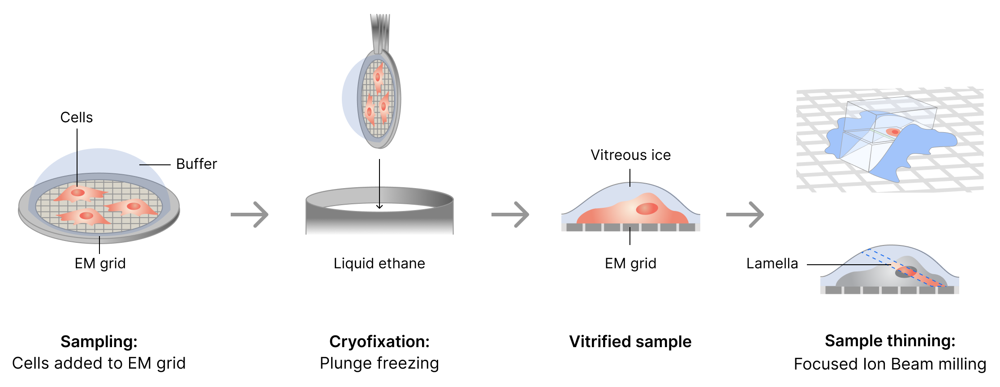
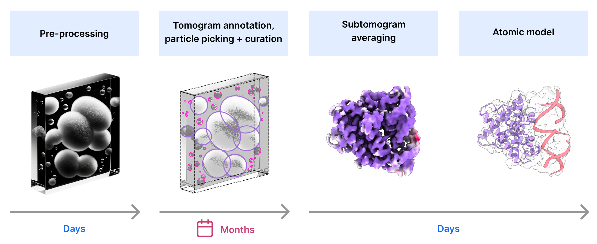

(cryoet-workflow)=
# CryoET Workflow

CryoET combines preservation of cellular structures in their native conformations with the power of 3D imaging.

## Overview

Cryo-electron tomography (cryoET) generates 3D images of biological samples at a range of resolutions, from whole cells to molecules at near atomic resolution. This article describes a general cryoET workflow to image cells and subcellular components, including sample preparation, data collection, and image processing. We also summarize advances that have enabled image processing of large datasets through automation.

## Sample Preparation

CryoET can be applied to different types of specimens (from particles to cells and small organisms). This article focuses on cryoET methods geared towards imaging cells and subcellular components, specifically samples < 500 nm in thickness. The schematic and steps below provide an overview of how cryoET samples are prepared for imaging:

<figure>
  
  <figcaption style="width:75%;">Schematic of protocol workflow for preparing cryoET samples. EM - electron microscopy; FIB - focus ion beam.
  </figcaption>
</figure>

### General Steps for CryoET Sample Preparation

1. **Sampling:** Cells are grown directly on electron microscopy (EM) gold or copper grids or samples are placed onto grids.

2. **Cryofixation:** Cryofixation through plunge freezing is used to vitrify cryoET samples that are < 500 nm thick. Vitrification is achieved through a rapid and massive temperature drop (cooling rate ~ 1,000–3,000 °C/s). To vitrify samples, excess liquid is removed from the EM grid and the grid is rapidly submerged (plunged) into a cryogen (e.g., liquid ethane).

3. **Sample Thinning:** To image samples through transmission electron microscopy (TEM), samples should be ≤ 200 nm thick. Focus Ion Beam (FIB) milling is used to thin a vitrified sample and produce _lamella_ , a thin section that can be penetrated by electron beams. During FIB, a focused beam of ions (e.g., gallium) is used to remove material above and below the section of interest while keeping the samples vitrified at cryogenic temperatures. This thinning method is known as cryo-FIB and it enables researchers to open windows into a cellular environment that otherwise would be too thick to image through TEM. Some cryo-FIB protocols include fluorescent labels that can be used during milling to find and retrieve cellular regions of interest.

## Data Collection

After sample preparation, grids with lamellae are inserted in the TEM on a rotational stage. The stage progressively tilts the sample over a fixed point or tilt axis, providing different tilt angles relative to the illuminating electron beam. Low electron beam doses are used to minimize specimen damage while collecting images as the specimen is tilted. Typically, the tilting occurs in 1° to 3° increments throughout a tilt range of approximately −60° to +60°. At each tilt angle, the electron detector camera records a movie stack consisting of 3 to 7 frames.

<figure>
  
  <figcaption style="width:75%;">Schematic highlighting projected images after an electron beam illuminates a specimen at various tilt angles. For the purposes of this example, the tilting shows 30° increments throughout a 120° tilt range (-60° to +60°). A movie stack consisting of 5 frames is collected at each tilt angle.
  </figcaption>
</figure>

The order in which images are collected throughout the tilt range depends on the _tilt scheme_. The tilt scheme may affect the preservation of high-resolution features given that the specimen decays while being exposed to the electron beam. As the image collection proceeds, the total accumulated electron dose increases, the specimen decays, and smaller features are disturbed. Therefore, high-resolution features may be lost in images collected towards the end of the tilt scheme. The image below summarizes the tilting strategy for three common types of tilt schemes, including unidirectional, bidirectional and dose-symmetric.

<figure>
  
  <figcaption style="width:75%;">Common tilt schemes used for cryoET imaging. The color legend indicates the tilt order for each scheme while arrows indicate the tilting direction. Note that as the image collection proceeds, the specimen decays and image quality decreases (highlighted by the lighter colors towards the end of each tilt scheme). Unidirectional tilt schemes collect images throughout the tilt range in a single, continuous sweep. Bidirectional schemes split the tilt range and collect images in two separate stages. Dose-symmetric tilt schemes image low tilt angles first in positive and negative directions, then move to higher angles in a sequential manner (e.g., tilt angle order in 3° increments: 0°, +3°, −3°, −6°, +6°, +9°, −9° ... +60°, -60°). Image adapted from <a href="https://www.nature.com/articles/s41467-020-14535-2">Turoňová et al., 2020</a>.
  </figcaption>
</figure>

**Unidirectional tilt scheme:** In the unidirectional scheme, the tilt angle is rotated in one direction.

**Bidirectional tilt scheme:** The bidirectional tilt scheme divides image acquisition into two separate tilt stages. For example, during the first stage, a continuous series is collected from 0° to +60° in 3° increments. During the second stage, a second continuous series is collected from -3° to -60° in 3° increments.

**Dose-symmetric tilt scheme:** The dose-symmetric tilt scheme is used to maximize high resolution information by first taking images where the electron beam has a thinner path through the specimen (i.e., low tilt angles) before radiation damage has accumulated.

## Image Processing

Through image processing, researchers can use collected 2D images at various tilt angles to reconstruct 3D sample views or maps, known as tomograms. There are several image processing steps to go from raw images to a tomogram and, subsequently, to high resolution particle reconstruction through subtomogram averaging. The schematic and descriptions below provide an overview of the image processing workflow.

<figure>
  
  <figcaption style="width:75%; text-align:center;">CryoET image processing workflow.
  </figcaption>
</figure>

### Image Preprocessing

**Tilt series assembly:** The first step to process images collected during data acquisition is to create a movie stack per tilt. Each movie stack consisting of 3 to 7 frames, is used to correct images for artifacts resulting from specimen movement (i.e., motion correction) and summed into a single, de-blurred image. The summed frames from each tilt angle form a tilt series image stack that is assembled into a tilt series.

<figure>
  
  <figcaption style="width:75%;">Tilt series assembly workflow. Movie stacks are summed into single, sharper images for each tilt angle. Summed frames are then used to assemble a tilt series.
  </figcaption>
</figure>

**Tilt series correction:** The tilt series has to be corrected for artifacts generated due microscope optical properties and settings (e.g., defocus) used to generate contrast (see Contrast Transfer Function, CTF).

**Tilt series alignment and tomogram reconstruction:** Corrected images in the tilt series have to be aligned for tomogram reconstruction. Near-perfect tilt series alignment is critical to obtain high quality tomograms that are centered and, thus, represent a true rotation around a single axis. A 3D volume of the sample is reconstructed from the aligned tilt series through a computational method known as back-projection. Through back-projection, a 3D density distribution of the specimen is calculated from the sum of all densities within the tilt series.

<figure>
  

  <video controls autoplay loop muted playsinline style="padding-right: 10px;">
    <source src="_static/img/raw_tilt_series.mp4" type="video/mp4" />
    
  </video>
    <video controls autoplay loop muted playsinline style="padding-right: 10px;">
    <source src="_static/img/aligned_tilt_series.mp4" type="video/mp4" />
    
  </video>
    <video controls autoplay loop muted playsinline style="width: 96%;">
    <source src="_static/img/Tomogram_filledFOV.mp4" type="video/mp4" />
    
  </video>
  

  <figcaption>Movie clips showcasing raw tilt series (unaligned), tilt series after alignment, and tomogram of a purified lysosome.
  </figcaption>
</figure>

**Tomogram denoising:** CryoET images have a very low signal to noise ratio (SNR) due to low electron doses used to image the samples. Denoising is an important step to increase the SNR and improve tomogram resolution. There are several denoising approaches geared towards identifying structural features, such as edges, or patterns that represent true biological components and remove everything else that is considered noise.

<figure>
  
  <figcaption style="width:75%;">Before and after images showing SNR and resolution improvement after denoising.
  </figcaption>
</figure>

### Tomogram annotation

Once the tomogram SNR has been improved through denoising, structures of interest have to be identified and delineated. The process of identifying and marking distinct features (e.g., membranes) by connecting tomogram segments is known as _segmentation_. Identified features are labeled (or annotated) with the appropriate name using their 3D coordinates.

<figure>
  <video controls autoplay loop muted playsinline style="width: 50%;">
    <source src="_static/img/annotation_movie.mp4" type="video/mp4" />
    Chlamydomonas reinhardtii</i>. Annotations include membranes, F1F0-ATPase and ribosomes. Displayed data is from a <a href="https://cryoetdataportal.czscience.com/runs/14069">run</a> within <a href="https://cryoetdataportal.czscience.com/datasets/10301">dataset 10301</a> on the cryoET data portal. Scale bar is 200 nm."
      width="100%"
    >
  </video>
  <figcaption style="width: 50%;">Cryo electron tomogram of a FIB-milled lamella of <i>Chlamydomonas reinhardtii</i>. Annotations include membranes, F1F0-ATPase and ribosomes. Displayed data is from a <a href="https://cryoetdataportal.czscience.com/runs/14069">run</a> within <a href="https://cryoetdataportal.czscience.com/datasets/10301">dataset 10301</a> on the cryoET data portal.
  </figcaption>
</figure>

### Subtomogram averaging

Tomogram resolution is limited to ~2 - 5 nm, which is above the resolution needed to investigate the molecular structure of biological components. High resolution structures are achieved through subtomogram averaging (STA), where repeating particles of interest within tomograms are averaged to obtain structures with sub-nanometer resolution (3Å - 10Å).

<figure>
  
  <figcaption style="width:75%; text-align: center;">Subtomogram averaging workflow.
  </figcaption>
</figure>

Large numbers of particles (hundreds to thousands) are needed to reconstruct molecular structures with resolutions below 10 Å. For STA to work, it is imperative that researchers are able to correctly locate and identify particles that represent the same biological component within tomograms. Therefore, particle picking and curation is an important step to identify as many repeating particles as possible. However, picking and identifying 3D particle coordinates in noisy tomograms can be challenging and STA efforts depend on high quality tomograms. Once repeating 3D particles have been identified, they are individually extracted, aligned, refined, and averaged.

## Automation in CryoET Image Processing

CryoET data analysis can be difficult and time consuming. Therefore, the development of software and machine learning (ML) methods that can speed up data processing is essential to propel advances in the cryoET field. The schematic below highlights the time it takes to process images to obtain molecular structures.

<figure>
  
  <figcaption style="width:75%; text-align:center;">CryoET image processing workflow showing the time it takes to get through each step.
  </figcaption>
</figure>

Thanks to advances in cryoET image processing, researchers can now collect large datasets and preprocess them in real time using software packages (e.g., [Aretomo3](https://github.com/czimaginginstitute/AreTomo3)) that reconstruct tomograms in parallel to data acquisition. Self-supervised neural networks (e.g., [Noise2Void](https://github.com/juglab/n2v)) have been leveraged to improve denoising of generated tomograms contributing to automated processing. The ability to process larger datasets enables researchers to reconstruct molecular structures with higher resolutions through STA.

Identifying tomogram features through segmentation and particle picking is the main rate-limiting step during image analysis. Semi-automated detection through unsupervised ML algorithms that match tomogram densities with those of a known particle, or template, have been used to annotate denoised tomograms. This is known as template matching. Through an iterative process, annotations based on template matching are manually curated and used for subsequent rounds of segmentation and particle picking. This approach has been successful to study relatively large and abundant complexes (e.g., ribosomes) but it requires extensive manual curation. Efforts to develop deep learning algorithms (e.g., Convolutional Neural Networks) that can be trained on small annotated datasets promise to fully automate and speed up particle annotation in the future.

Below is a summary of a workflow established by the Chan Zuckerberg Imaging Institute (CZII) to highlight automated steps and software development efforts.

<figure>
  
  <figcaption style="width:75%;">Workflow highlighting software, real time steps, and current machine learning development efforts at CZII. Implemented software includes <a href="https://github.com/czimaginginstitute/AreTomo3">Aretomo3</a>, DenoiseET, <a href="https://github.com/apeck12/slabpick">Minislab</a>, <a href="https://github.com/copick/DeepFindET">DeepFindET</a>, and <a href="https://github.com/3dem/relion?tab=readme-ov-file">RELION</a>.
  </figcaption>
</figure>
