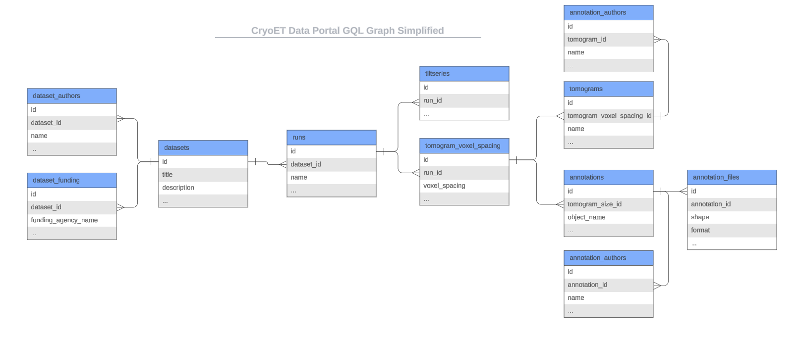

Python API
==============================

Data Model
----------
The Python API client is primarily a GraphQL client that interacts with our GraphQL API endpoint. The data model for the python API client and the GraphQL API are identical.

If you prefer to query our API endpoint directly, it's available at `https://graphql.cryoetdataportal.cziscience.com/v1/graphql <https://graphql.cryoetdataportal.cziscience.com/v1/graphql>`_

A simplified diagram of the graph data model is below:

Client
------
  .. autoclass:: cryoet_data_portal.Client
     :members:
     :inherited-members:

Dataset
-------
.. autoclass:: cryoet_data_portal.Dataset
   :members:
   :inherited-members:

DatasetAuthor
-------------
.. autoclass:: cryoet_data_portal.DatasetAuthor
   :members:
   :inherited-members:

DatasetFunding
--------------
.. autoclass:: cryoet_data_portal.DatasetFunding
   :members:
   :inherited-members:

Run
--------------
.. autoclass:: cryoet_data_portal.Run
   :members:
   :inherited-members:

TomogramVoxelSpacing
----------------
.. autoclass:: cryoet_data_portal.TomogramVoxelSpacing
   :members:
   :inherited-members:

Tomogram
--------------
.. autoclass:: cryoet_data_portal.Tomogram
   :members:
   :inherited-members:

TomogramAuthor
--------------
.. autoclass:: cryoet_data_portal.TomogramAuthor
   :members:
   :inherited-members:

Annotation
--------------
.. autoclass:: cryoet_data_portal.Annotation
   :members:
   :inherited-members:

AnnotationFile
--------------
.. autoclass:: cryoet_data_portal.AnnotationFile
   :members:
   :inherited-members:

AnnotationAuthor
----------------
.. autoclass:: cryoet_data_portal.AnnotationAuthor
   :members:
   :inherited-members:

TiltSeries
----------------
.. autoclass:: cryoet_data_portal.TiltSeries
   :members:
   :inherited-members:
