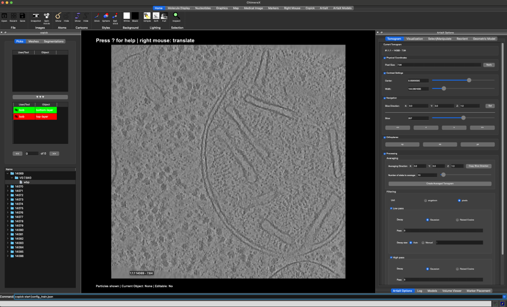
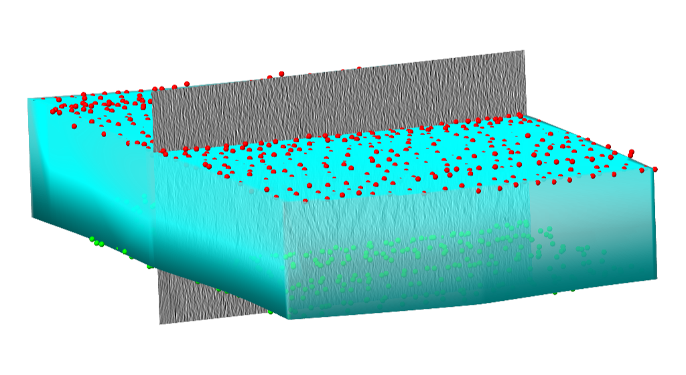

## Predicting sample boundaries

<figure markdown="span">
  
  
  <figcaption>Side view onto a cryo-electron tomogram (<a href="https://cryoetdataportal.czscience.com/runs/15094">run 15094</a>)
without (left) and with (right) sample boundary annotation</figcaption>
</figure>

Biological samples acquired in a cryoET experiment are usually thin slabs of vitrified ice containing the biological
specimen of interest. Unfortunately, it is difficult to determine orientation and thickness of the samples ahead of
reconstruction. For this reason, volumes reconstructed from cryoET tilt series are often larger than the actual sample
and contain a significant amount of empty space (i.e. the vacuum inside the TEM column).

There are several reasons for why it can be useful to determine more accurate sample boundaries, e.g.

- statistical analysis of the sample preparation process
- masking out the vacuum region to reduce the size of the volume
- masking out the vacuum region during the training of a neural network
- capping of membrane segmentations to define topological boundaries

Below, we will show how to use [**copick**](https://github.com/copick/copick), an adapted version of [deepfinder](https://github.com/jtschwar/cryoet-deepfinder/tree/master)
and [album](https://album.solutions/) to predict sample boundaries for datasets [10301](https://cryoetdataportal.czscience.com/datasets/10301)
and [10302](https://cryoetdataportal.czscience.com/datasets/10302) from the
[CZ cryoET Data Portal](https://cryoetdataportal.czscience.com). Copick is a cross-platform, storage-agnostic and server-less dataset API for cryoET datasets.

<figure markdown="span">
  {width="400"}
  <figcaption>Top view onto the same tomogram (<a href="https://cryoetdataportal.czscience.com/runs/15094">run 15094</a>)
from dataset <a href="https://cryoetdataportal.czscience.com/datasets/10302">10302</a>.</figcaption>
</figure>

### Step 0: Environment and Pre-requisites

For the purpose of this tutorial we will assume that we are working on a machine with access to an NVIDIA GPU and a
working `CUDA 12.3`/`CUDNN 8.9` installation. Before we can start, we need to install the necessary software. We will
use the following tools:

#### 1. ChimeraX and ChimeraX-copick (for visualization and annotation)

Download and install ChimeraX from [here](https://www.cgl.ucsf.edu/chimerax/download.html). After installing ChimeraX,
install the ChimeraX-copick extension by running the following command in ChimeraX:

```
toolshed install copick
```

#### 2. Album and copick-catalog (for processing steps)

Comprehensive installation instructions for Album can be found on the [Album docs website](https://docs.album.solutions/en/latest/installation-instructions.html).

TL;DR:
```bash
conda create -n album album -c conda-forge
conda activate album
```

Now, add copick's Album catalog ([copick-catalog](https://github.com/copick/copick-catalog)) to your album
installation and install the requried solutions by running the following commands:

```bash
album add-catalog git@github.com:copick/copick-catalog.git
album update && album upgrade
album install copick:create_empty_picks:0.2.0
album install copick:fit_sample:0.7.0
album install copick:create_rec_limits:0.5.0
album install copick:intersect_mesh:0.5.0
album install copick:mesh_to_seg:0.7.0
album install copick:sample_mesh:0.5.0
album install copick:fit_sample_seg:0.9.0
```


#### 3. J-finder (for segmentation)

Download and install a copick-compatible version of deepfinder:

```bash
conda create -n deepfinder python=3.10
conda activate deepfinder
git clone https://github.com/jtschwar/cryoet-deepfinder.git
cd cryoet-deepfinder
pip install .
```

### Step 1: Setup your copick projects

We will create two copick projects that use datasets 10301 and 10302 from the CZ cryoET Data Portal. Both datasets stem
from the same experiments and have the same characteristics, but the tomograms in dataset 10301 have protein annotations.
We will use dataset 10301 as a training set and evaluate on dataset 10302.

We will store new annotations in a local directory, called the "overlay", while the tomogram image data is obtained
from the CZ cryoet data portal. In the following, we will create a configuration file `config_train.json` that describes
the project. The configuration file is a JSON file that contains all information necessary to access the data and
describing the objects that can be accessed and created using the copick API.

The first part of the configuration file provides general information about the project, such as the project name,
description, and copick-API version.

??? example "click to expand"
    ```json
    {
      "config_type": "cryoet_data_portal",
      "name": "Sample Boundary Prediction - Training Set",
      "description": "This project uses dataset 10301 from the CZ cryoET Data Portal as a training set for sample boundary prediction.",
      "version": "0.5.4"
    }
    ```

Next, we define the objects that can be accessed and created using the copick API. In this case we will create X objects:

- top-layer -- the top layer of the sample
- bottom-layer -- the bottom layer of the sample
- valid-area -- the valid area of the reconstructed tomogram
- sample -- the sample itself
- valid-sample -- the sample excluding the invalid reconstruction area

??? example "click to expand"
    ```json
    {
      "pickable_objects": [
            {
                "name": "top-layer",
                "is_particle": true,
                "label": 100,
                "color": [  255, 0, 0, 255],
                "radius": 150,
                "map_threshold": 0.037
            },
            {
                "name": "bottom-layer",
                "is_particle": true,
                "label": 101,
                "color": [
                    0,
                    255,
                    0,
                    255
                ],
                "radius": 150,
                "map_threshold": 0.037
            },
            {
                "name": "sample",
                "is_particle": false,
                "label": 102,
                "color": [  0, 0, 255, 128],
                "radius": 150,
                "map_threshold": 0.037
            },
            {
                "name": "valid-area",
                "is_particle": false,
                "label": 103,
                "color": [
                    255,
                    255,
                    0,
                    128
                ],
                "radius": 150,
                "map_threshold": 0.037
            },
            {
                "name": "valid-sample",
                "is_particle": false,
                "label": 2,
                "color": [
                    0,
                    255,
                    255,
                    128
                ],
                "radius": 150,
                "map_threshold": 0.037
            }
        ]
    }
    ```

Finally, we define where **copick** should look for the data and store any annotations (in this case the home directory
of Bob).

??? example "click to expand"
    ```json
    {
      "overlay_root": "local:///home/bob/copick_project_train/",
      "overlay_fs_args": {
        "auto_mkdir": true
      },
      "dataset_ids" : [10301]
    }
    ```

We will repeat this process for a second project, `config_evaluate.json`, that includes both dataset 10301 and dataset
10302 for evaluation. Find both full examples below:


??? example "`config_train.json`"
    ```json
    {
      "config_type": "cryoet_data_portal",
      "name": "Sample Boundary Prediction - Training Set",
      "description": "This project uses dataset 10301 from the CZ cryoET Data Portal as a training set for sample boundary prediction.",
      "version": "0.5.4",
      "pickable_objects": [
            {
                "name": "top-layer",
                "is_particle": true,
                "label": 100,
                "color": [  255, 0, 0, 255],
                "radius": 150,
                "map_threshold": 0.037
            },
            {
                "name": "bottom-layer",
                "is_particle": true,
                "label": 101,
                "color": [
                    0,
                    255,
                    0,
                    255
                ],
                "radius": 150,
                "map_threshold": 0.037
            },
            {
                "name": "sample",
                "is_particle": false,
                "label": 102,
                "color": [  0, 0, 255, 128],
                "radius": 150,
                "map_threshold": 0.037
            },
            {
                "name": "valid-area",
                "is_particle": false,
                "label": 103,
                "color": [
                    255,
                    255,
                    0,
                    128
                ],
                "radius": 150,
                "map_threshold": 0.037
            },
            {
                "name": "valid-sample",
                "is_particle": false,
                "label": 2,
                "color": [
                    0,
                    255,
                    255,
                    128
                ],
                "radius": 150,
                "map_threshold": 0.037
            }
        ],
      "overlay_root": "local:///home/bob/copick_project_train/",
      "overlay_fs_args": {
        "auto_mkdir": true
      },
      "dataset_ids" : [10301]
    }
    ```


??? example "`config_evaluate.json`"
    ```json
    {
      "config_type": "cryoet_data_portal",
      "name": "Sample Boundary Prediction - Evaluation Set",
      "description": "This project uses datasets 10301 and 10302 from the CZ cryoET Data Portal for sample boundary prediction.",
      "version": "0.5.4",
      "pickable_objects": [
            {
                "name": "top-layer",
                "is_particle": true,
                "label": 100,
                "color": [  255, 0, 0, 255],
                "radius": 150,
                "map_threshold": 0.037
            },
            {
                "name": "bottom-layer",
                "is_particle": true,
                "label": 101,
                "color": [
                    0,
                    255,
                    0,
                    255
                ],
                "radius": 150,
                "map_threshold": 0.037
            },
            {
                "name": "sample",
                "is_particle": false,
                "label": 102,
                "color": [  0, 0, 255, 128],
                "radius": 150,
                "map_threshold": 0.037
            },
            {
                "name": "valid-area",
                "is_particle": false,
                "label": 103,
                "color": [
                    255,
                    255,
                    0,
                    128
                ],
                "radius": 150,
                "map_threshold": 0.037
            },
            {
                "name": "valid-sample",
                "is_particle": false,
                "label": 2,
                "color": [
                    0,
                    255,
                    255,
                    128
                ],
                "radius": 150,
                "map_threshold": 0.037
            }
        ],
      "overlay_root": "local:///home/bob/copick_project_evaluate/",
      "overlay_fs_args": {
        "auto_mkdir": true
      },
      "dataset_ids" : [10301, 10302]
    }
    ```

### Step 2: Annotate the training set

We will now use ChimeraX to annotate the top- and bottom- boundaries of the training set. In a first step we will create
empty `CopickPicks` objects for the top- and bottom-layer in the training set. To do this we use the
`create_empty_picks`-solution:

```bash
album run copick:create_empty_picks:0.2.0 \
--copick_config_path config_train.json \
--out_object top-layer \
--out_user bob \
--out_session 1

album run copick:create_empty_picks:0.2.0 \
--copick_config_path config_train.json \
--out_object bottom-layer \
--out_user bob \
--out_session 1
```

Open ChimeraX and start the copick extension by running the following command in the ChimeraX command line:

```
copick start config_train.json
```

<figure markdown="span">
  {width="800"}
  <figcaption>The ChimeraX-copick interface after loading run 14069.</figcaption>
</figure>


This will open a new window with the copick interface. On the top left side you will see the available objects, on the
bottom left you can find a list of runs in the dataset. On the right side you can find the interface of ArtiaX (the
plugin that allows you to annotate objects in ChimeraX).


Double-click a run's directory (e.g. `14069`) in the run list to show the available resolutions, double-click the
resolution's directory (`VS:7.840`) to display the available tomograms. In order to load a tomogram, double-click the
tomogram.

The tomogram will be displayed in the main viewport in the center. Available pickable objects are displayed in the
list on the left side. Select a pickable object (e.g. top-layer) by double-clicking it and start annotating the top-border
of the sample by placing points on the top-border of the sample.

You can switch the slicing direction in the `Tomogram`-tab on the right. You can move through the 2D slices of the
tomogram using the slider on the right or `Shift + Mouse Wheel`. For more information on how to use the copick interface,
see the info box below and refer to the [ChimeraX documentation](https://www.cgl.ucsf.edu/chimerax/docs/user/index.html).

??? note "Keyboard Shortcuts"
    **Particles**

    - `--` Remove Particle.
    - `00` Set 0% transparency for active particle list.
    - `55` Set 50% transparency for active particle list.
    - `88` Set 80% transparency for active particle list.
    - `aa` Previous Particle.
    - `dd` Next Particle.
    - `sa` Select all particles for active particle list.
    - `ss` Select particles mode
    - `ww` Hide/Show ArtiaX particle lists.

    **Picking**

    - `ap` Add on plane mode
    - `dp` Delete picked mode
    - `ds` Delete selected particles

    **Visualization**

    - `cc` Turn Clipping On/Off
    - `ee` Switch to orthoplanes.
    - `ff` Move planes mouse mode.
    - `qq` Switch to single plane.
    - `rr` Rotate slab mouse mode.
    - `xx` View XY orientation.
    - `yy` View YZ orientation.
    - `zz` View XZ orientation.

    **Info**

    - `?` Show Shortcuts in Log.
    - `il` Toggle Info Label.

At the end of this step, you should have annotated the top- and bottom-layer of the all 18 tomograms in the training set.

<figure markdown="span">
  
  
  <figcaption>Points clicked along the top and bottom boundary of the sample of a tomogram.</figcaption>
</figure>

### Step 3: Create the training data

#### Valid reconstruction area

Next, we will create the training data for the sample boundary prediction. First, we will create bounding boxes that
describe the valid reconstruction area in each tomogram. In most TEMs, the tilt axis is not exactly parallel to
either of the detector axes, causing tomograms to have small regions of invalid reconstruction at the corners. Using
the `create_rec_limits`-solution, we can compute 3D meshes that describe the valid reconstruction area in each
tomogram.

In this case, we will assume an in-plane rotation of -6 degrees.

```bash
album run copick:create_rec_limits:0.5.0 \
--copick_config_path config_train.json \
--voxel_spacing 7.84 \
--tomo_type wbp \
--angle -6 \
--output_object valid-area \
--output_user bob \
--output_session 0
```

You can now visualize the created bounding boxes in ChimeraX by restarting the copick interface and selecting the
`valid-area` object in the Mesh-tab on the left side.

<figure markdown="span">
  
  
  <figcaption>Top view onto a tomogram (<a href="https://cryoetdataportal.czscience.com/runs/14069">run 15094</a>) without (left)
and with (right) valid reconstruction area mesh overlayed.</figcaption>
</figure>

#### Sample

Now, we will use the points created in [Step 2](#step-2-annotate-the-training-set) to create a second 3D mesh that
describes the sample boundaries. We do this, by fitting a plane defined by a cubic spline grid to the points using the
[torch-cubic-spline-grid](https://github.com/teamtomo/torch-cubic-spline-grids) package in the `fit_sample`-solution.

```bash
album run copick:fit_sample:0.7.0 \
--copick_config_path config_train.json \
--top_object top-layer \
--bottom_object bottom-layer \
--input_user bob --input_session 1 \
--voxel_spacing 7.84 \
--tomo_type wbp \
--output_object sample \
--output_user bob \
--output_session 0
```

#### Intersection

Next, we will intersect the valid reconstruction area with the sample to create a new object that describes the valid
sample area. We do this using the `intersect_mesh`-solution:

```bash
album run copick:intersect_mesh:0.5.0 \
--copick_config_path config_train.json \
--object_a valid-area \
--user_a bob \
--session_a 0 \
--object_b sample \
--user_b bob \
--session_b 0 \
--output_object valid-sample \
--output_user bob \
--output_session 0 \
```
You can now visualize the final 3D mesh for training in ChimeraX by restarting the copick interface and selecting the
`valid-area` object in the Mesh-tab on the left side.

<figure markdown="span">
  {width="400"}
  <figcaption>Side view of the tomogram with points and intersected, valid sample area.</figcaption>
</figure>


#### Training data

Finally, we will create the training data for the sample boundary prediction. We will use the `mesh_to_seg`-solution to
create a dense segmentation of the same size as the tomogram from the 3D meshes.

```bash
album run copick:mesh_to_seg:0.7.0 \
--copick_config_path config_train.json \
--input_object valid-sample \
--input_user bob \
--input_session 0 \
--voxel_spacing 7.84 \
--tomo_type wbp
```

We also need to determine where sub-volumes for training should be cropped. This allows us to ensure the correct ratio
of positive and negative samples in the training data. We will use the `sample_mesh`-solution to create a set of
points sampled using poisson disk and rejection sampling. The solution allows to specify the number of points inside,
on the surface and outside the mesh.

```bash
album run copick:sample_mesh:0.5.0 \
--copick_config_path config_train.json \
--input_object valid-sample \
--input_user bob \
--input_session 0 \
--voxel_spacing 7.84 \
--tomo_type wbp \
--num_surf 300 \        # Number of points on the surface of the mesh
--num_internal 300 \    # Number of points inside of the mesh
--num_random 100 \      # Number of points outside of the mesh
--min_dist 200 \        # Minimum distance between points in angstrom
--output_user bob
```

The resulting segmentations will have the same name, user and session ID as the input object. You can now visualize the
segmentations in ChimeraX by restarting the copick interface and selecting the `valid-sample` object in the
`Segmentation`-tab on the top left part of the interface. You can also visualize the sampled points from the
`Points`-tab on the left side.


### Step 4: Train the model

#### Create the multilabel segmentation
In the next step, we will create a second dense segmentation volume that contains the sample segmentation from the
[previous step](#step-3-create-the-training-data). This is redundant in this case, but necessary for the training of the
J-finder model if there were multiple segmentation targets. While the segmentation created previously is a binary mask,
the segmentation volume created here contains integer labels for each voxel, corresponding to the "label" field in the
`pickable_objects`-list in the configuration file.

In order to do this, we will run step 1 of the J-finder pipeline:

```bash
step1 create \
--config config_train.json \
--target valid-sample bob 0 0 \          # Format: input-picks-name user session radius
--seg-target valid-sample bob 0 \        # Format: input-segmentation-name from-mesh user session
--voxel-size 7.84 \
--tomogram-algorithm wbp \
--out-name sampletargets
```

This should create a new segmentation volume with name `sampletargets`, user `train-deepfinder` and session `0`.

#### Train the model

Next, we will train the J-finder model using the training data created in the previous steps. We will use the
`train`-command of the J-finder pipeline:

```bash
mkdir outputs

step2 train \
--path-train config_train.json \
--train-voxel-size 7.84 \
--train-tomo-type wbp \
--output-path outputs/ \
--n-class 3 --dim-in 64 \
--valid-tomo-ids 14069,14070,14071 \
--train-tomo-ids 14072,14073,14074,14075,14076,14077,14078,14079,14080,14081,14082,14083,14084,14085,14086 \
--sample-size 10 \
--label-name sampletargets \
--target valid-sample bob 0
```

In this case, runs `14069`, `14070`, and `14071` will be used for validation, while the remaining runs will be used for
training. The model will be trained for 10 epochs with a sample size of 10. The model will be saved in the
`outputs`-directory.

### Step 5: Evaluate the model

Now, we will evaluate the model on the evaluation set. For demonstration purposes we will only evaluate on three
tomograms. We will use the `segment`-command of the J-finder pipeline:

```bash
step3 segment \
--predict-config config_evaluate.json \
--path-weights outputs/net_weights_FINAL.h5 \
--n-class 3 --patch-size 196 \
--voxel-size 7.84 \
--tomogram-algorithm wbp \
--segmentation-name segmentation \
--user-id output \
--session-id 0 \
--tomo-ids 14114,14132,14137,14163
```

This will create a new segmentation volume with name `segmentation`, user `output` and session `0` for the tomograms
`14114`, `14132`, `14137`, and `14163`. You can now visualize the segmentations in ChimeraX by restarting the copick interface
and selecting the `segmentation` object in the `Segmentation`-tab on the top left part of the interface.

<figure markdown="span">
  {width="800"}
  <figcaption>Segmentation generated by the model and box fit to the segmentation.</figcaption>
</figure>

### Step 6: Post-processing

Finally, we will post-process the segmentations to create the final sample boundaries. The segmentations can contain
small isolated regions that are not part of the sample. We will use the `fit_sample_seg`-solution to fit a box with
parallel sides to the segmentation.

```bash
album run copick:fit_sample_seg:0.9.0 \
--copick_config_path config_evaluate.json \
--top_object top-layer \
--bottom_object bottom-layer \
--input_user output \
--input_session 0 \
--seg_name segmentation \
--voxel_spacing 7.84 \
--tomo_type wbp \
--run_names 14114,14132,14137,14163 \
--output_object valid-sample \
--output_user output \
--output_session 0
```

You can now visualize the final 3D mesh for evaluation in ChimeraX by restarting the copick interface and selecting the
`valid-sample` object in the `Mesh`-tab on the left side. Below you can see the final result for the three tomograms
`14114`, `14132`, `14137`, and `14163`.


<figure markdown="span">
  {width="800"}
  <figcaption> Clipped boundaries predicted for <a href="https://cryoetdataportal.czscience.com/runs/14114">run 14114</a>,
  <a href="https://cryoetdataportal.czscience.com/runs/14132">run 14132</a>,
  <a href="https://cryoetdataportal.czscience.com/runs/14137">run 14137</a>, and
  <a href="https://cryoetdataportal.czscience.com/runs/14163">run 14163</a> (left to right, top to bottom).</figcaption>
</figure>
