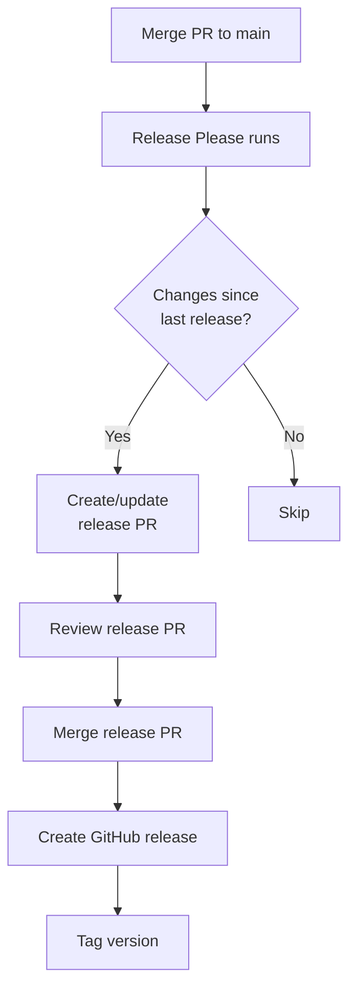

# Release Process

This document explains how releases work in the CryoET Data Portal frontend. The project uses Release Please to automate versioning, changelog generation, and GitHub releases based on conventional commits.


## Quick Overview

The release process is fully automated:

1. **Merge PR to main** - Commits following conventional format
2. **Release Please opens PR** - Automatically updates version and changelog
3. **Review and merge release PR** - Triggers release creation
4. **GitHub Release published** - With generated changelog and git tag

**Current version:** 1.79.0 (as of December 2024)

---

## Release Please Workflow

Release Please is a GitHub Action that automates releases based on conventional commits.

### How It Works



### Trigger

Release Please runs automatically:

```yaml
# .github/workflows/release-please.yml
on:
  workflow_dispatch: # Manual trigger
  push:
    branches:
      - main # Automatic on main push
```

**Every push to main:**

- Analyzes commits since last release
- Determines version bump based on commit types
- Creates or updates release PR

---

## Semantic Versioning

The frontend follows [Semantic Versioning](https://semver.org/) (SemVer):

```
MAJOR.MINOR.PATCH
```

### Version Bumping Rules

| Commit Type                                                 | Version Bump  | Example         |
| ----------------------------------------------------------- | ------------- | --------------- |
| `feat`                                                      | Minor (0.x.0) | 1.78.0 → 1.79.0 |
| `fix`                                                       | Patch (0.0.x) | 1.78.0 → 1.78.1 |
| `perf`                                                      | Patch (0.0.x) | 1.78.0 → 1.78.1 |
| Breaking change (`!` or `BREAKING CHANGE:`)                 | Major (x.0.0) | 1.78.0 → 2.0.0  |
| `docs`, `style`, `refactor`, `test`, `chore`, `build`, `ci` | None          | No release      |

### Examples

**Feature commits (minor bump):**

```bash
# 1.78.0 → 1.79.0
feat: add tomogram selection dropdown
feat(viewer): add annotation layer controls
```

**Bug fix commits (patch bump):**

```bash
# 1.79.0 → 1.79.1
fix: resolve incorrect dataset count
fix(filters): correct organism name filtering
```

**Breaking change (major bump):**

```bash
# 1.79.0 → 2.0.0
feat!: migrate to GraphQL API v3

BREAKING CHANGE: Dataset.status renamed to Dataset.state
```

**Multiple commits:**

```bash
# If a PR contains:
feat: add feature A        # Minor bump
fix: fix bug B            # Patch bump
docs: update docs         # No bump

# Result: Minor bump (1.78.0 → 1.79.0)
# The highest precedence wins: feat > fix > no-bump
```

---

## Release PR

When commits are merged to main, Release Please creates or updates a release PR.

### Release PR Contents

**Title:**

```
chore(main): release cryoet-data-portal-frontend 1.79.0
```

**Changes:**

1. **CHANGELOG.md** - Updated with new entries
2. **Version bump** - If there's a manifest file (currently no package.json in frontend root)

### Example Release PR

```markdown
## [1.79.0](https://github.com/.../compare/v1.78.0...v1.79.0) (2025-12-08)

### ✨ Features

- Add tomogram selection dropdown to the viewer page (#1989)

---

This PR was generated with [Release Please](https://github.com/googleapis/release-please).
```

### Changelog Format

Changelog entries are grouped by type with emoji icons:

```markdown
### ✨ Features

- Add tomogram selection dropdown to the viewer page (#1989)
- Global Image Labels (#1958)

### 🐞 Bug Fixes

- organism name filter not working in annotations tab (#1960)
- add tomogram count to deposition (#1988)

### ⚡️ Performance Improvements

- split ESLint config to optimize VS Code performance (#1965)

### 🧹 Miscellaneous Chores

- update dependencies (#1955)
```

**Icon mapping** (from `release-please.config.json`):

- ✨ Features (`feat`)
- 🐞 Bug Fixes (`fix`)
- ⚡️ Performance Improvements (`perf`)
- ↩️ Reverts (`revert`)
- 📝 Documentation (`docs`)
- 💅 Styles (`style`)
- 🧹 Miscellaneous Chores (`chore`)
- ♻️ Code Refactoring (`refactor`)
- 🧪 Tests (`test`)
- 🛠️ Build System (`build`)
- ⚙ Continuous Integration (`ci`)

---

## Release Configuration

Configuration is defined in `release-please.config.json` at the repository root.

### Frontend Configuration

```json
{
  "packages": {
    "frontend": {
      "package-name": "cryoet-data-portal-frontend",
      "release-type": "simple",
      "bump-minor-pre-major": false,
      "bump-patch-for-minor-pre-major": false,
      "draft": false,
      "prerelease": false,
      "separate-pull-requests": true
    }
  }
}
```

**Key settings:**

- **`release-type: "simple"`** - No package.json to update (changelog only)
- **`separate-pull-requests: true`** - Frontend and Python client get separate release PRs
- **`bump-minor-pre-major: false`** - Breaking changes before 1.0.0 still bump major
- **`draft: false`** - Releases are published immediately
- **`prerelease: false`** - All releases are stable

### Version Tracking

Current versions are tracked in `release-please.manifest.json`:

```json
{
  "frontend": "1.79.0",
  "client/python/cryoet_data_portal": "4.5.0"
}
```

This file is automatically updated when release PRs are merged.

---

## Merging a Release PR

### Review the Release PR

1. **Check the version bump** - Is it correct for the changes?
   - New features → minor bump
   - Bug fixes only → patch bump
   - Breaking changes → major bump

2. **Review the changelog** - Are all changes documented?
   - All PRs since last release included
   - Descriptions are clear
   - Links to PRs work

3. **Verify commit history** - All commits follow conventional format

### Merge the Release PR

```bash
# Use GitHub UI or CLI
gh pr merge <PR_NUMBER> --squash

# Or via UI: Click "Squash and merge"
```

**Important:** Use **squash merge** to keep a clean history.

### Post-Merge Actions

After merging, Release Please automatically:

1. **Creates GitHub release** - With changelog as release notes
2. **Tags the commit** - With `cryoet-data-portal-frontend-v1.79.0`
3. **Updates manifest** - Records new version in `release-please.manifest.json`

---

## GitHub Releases

Releases are automatically created and published to GitHub.

### Release Contents

**Title:**

```
cryoet-data-portal-frontend-v1.79.0
```

**Tag:**

```
cryoet-data-portal-frontend-v1.79.0
```

**Release notes:**

```markdown
## [1.79.0](https://github.com/.../compare/v1.78.0...v1.79.0) (2025-12-08)

### ✨ Features

- Add tomogram selection dropdown to the viewer page (#1989)
```

### Accessing Releases

**Via GitHub UI:**

- Navigate to repository → Releases tab
- View all historical releases

**Via GitHub CLI:**

```bash
# List releases
gh release list

# View specific release
gh release view cryoet-data-portal-frontend-v1.79.0
```

**Via API:**

```bash
# Latest release
curl https://api.github.com/repos/chanzuckerberg/cryoet-data-portal/releases/latest

# All releases
curl https://api.github.com/repos/chanzuckerberg/cryoet-data-portal/releases
```

---

## Manual Release (Emergency)

In rare cases, you may need to trigger a release manually.

### Using workflow_dispatch

```bash
# Via GitHub CLI
gh workflow run release-please.yml

# Or via GitHub UI:
# Actions → Create Release PRs → Run workflow
```

### Creating a Release PR Manually

If Release Please fails:

1. **Update CHANGELOG.md** - Follow existing format
2. **Update version** - In manifest file if applicable
3. **Create PR** - With title: `chore(main): release cryoet-data-portal-frontend X.X.X`
4. **Merge PR** - Release Please will detect and create release

---

## Version History

Recent releases (from `frontend/CHANGELOG.md`):

```markdown
## [1.79.0](2025-12-08)

### ✨ Features

- Add tomogram selection dropdown to the viewer page (#1989)

## [1.78.0](2025-10-23)

### ✨ Features

- add XY-3d as option in layout (#1983)

### 🐞 Bug Fixes

- add tomogram count to deposition (#1988)

### ⚡️ Performance Improvements

- split ESLint config to optimize VS Code performance (#1965)

## [1.77.1](2025-10-10)

### 🐞 Bug Fixes

- preserve deposition method links order (#1974)

## [1.77.0](2025-10-09)

### ✨ Features

- launch global image labels (#1981)
```

---

## Troubleshooting

### Release PR Not Created

**Problem:** Merged PRs to main but no release PR appeared.

**Solutions:**

1. Check if commits follow conventional format:
   ```bash
   git log origin/main --pretty=format:"%s" -10
   ```
2. Verify commits have release-worthy types (`feat`, `fix`, `perf`)
3. Check Release Please workflow logs:
   ```bash
   gh run list --workflow=release-please.yml
   ```
4. Manually trigger workflow:
   ```bash
   gh workflow run release-please.yml
   ```

### Wrong Version Bump

**Problem:** Release PR bumped wrong version (e.g., patch instead of minor).

**Solution:**

1. Close the release PR
2. Check commit types in merged PRs
3. If correct: Update manifest manually and re-run workflow
4. If incorrect: Fix commit messages in history (use `git rebase -i`)

### Missing Changelog Entry

**Problem:** A merged PR doesn't appear in the changelog.

**Causes:**

- PR title/commits don't follow conventional format
- Commit type doesn't trigger changelog entry (`docs`, `chore`, etc.)

**Solution:**

1. Update CHANGELOG.md manually in next release
2. Or: Amend commit messages and force-push (not recommended)

### Multiple Release PRs

**Problem:** Multiple release PRs open for same version.

**Solution:**

1. Close older release PRs
2. Keep the newest one
3. Release Please will consolidate on next run

---

## Best Practices

### For Contributors

1. **Follow conventional commits** - Enables automatic releases
2. **Use correct commit types** - Determines version bump
3. **Write clear descriptions** - Appears in changelog
4. **Reference issues** - Links issues to releases

### For Maintainers

1. **Review release PRs promptly** - Keeps release cadence smooth
2. **Verify changelog accuracy** - Ensure user-facing changes are clear
3. **Check version bumps** - Confirm major/minor/patch is correct
4. **Coordinate with team** - For major releases or breaking changes

### Release Cadence

**Frontend releases:**

- No fixed schedule (release when ready)
- Typically 1-4 releases per month
- Driven by merged PRs with release-worthy changes

**Breaking changes:**

- Plan ahead and communicate with users
- Document migration steps
- Consider gradual rollout or deprecation period

---

## Next Steps

- [Commit Conventions](./03-commit-conventions.md) - Write release-worthy commits
- [Pull Request Guidelines](./02-pr-guidelines.md) - Create well-formed PRs
- [Code Style](./01-code-style.md) - Maintain code quality
