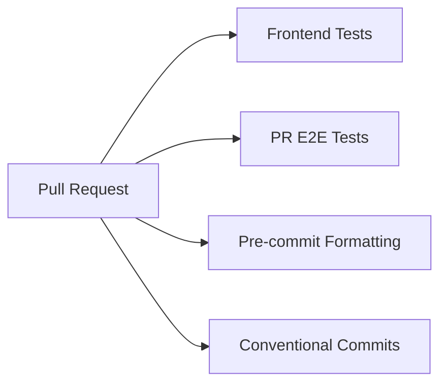
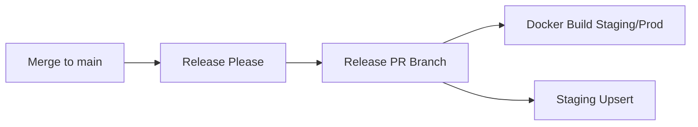
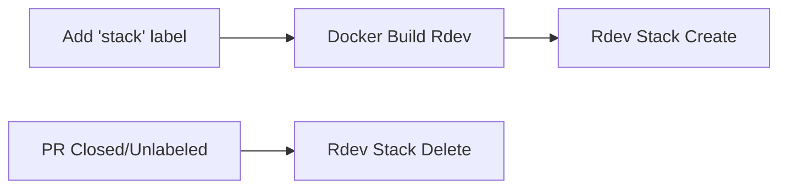
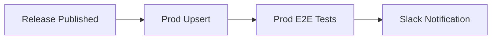
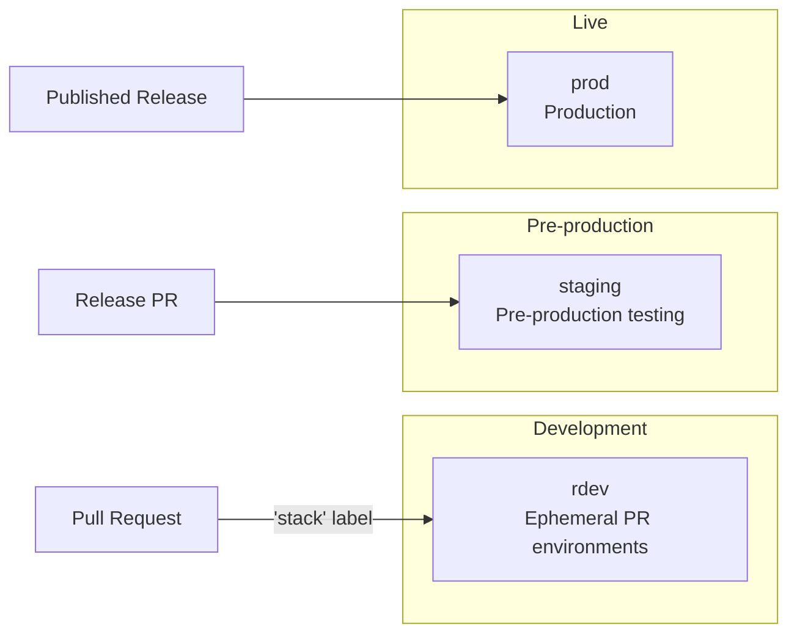
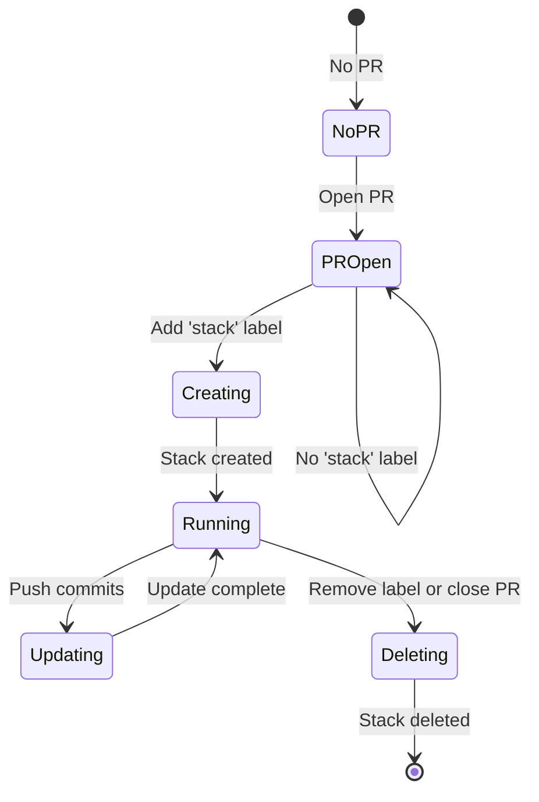
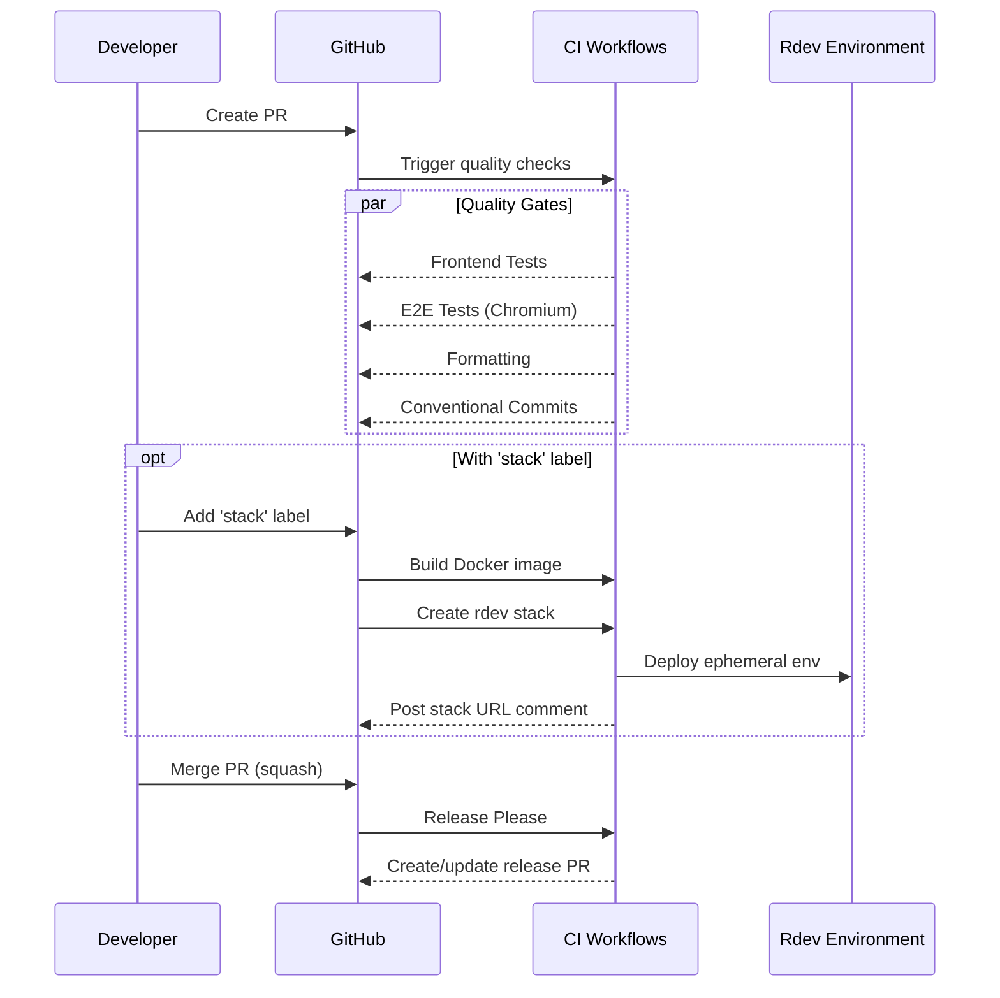
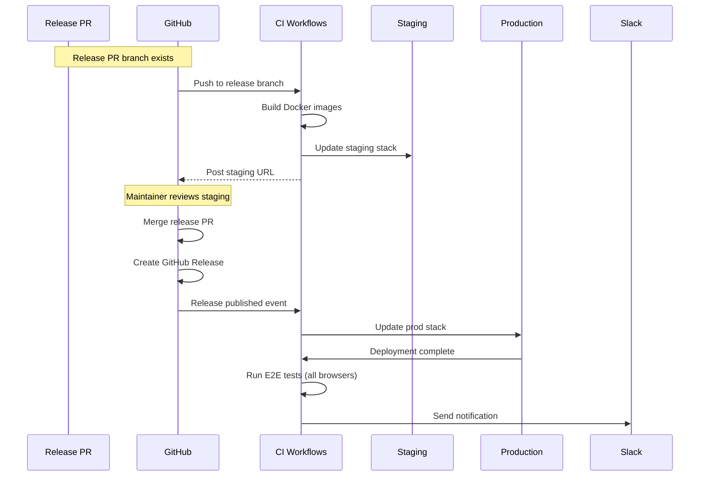

# GitHub Actions and Deployment

This document provides a comprehensive guide to the CI/CD pipelines and deployment workflows for the CryoET Data Portal frontend. Understanding these workflows helps contributors navigate PR requirements and maintainers manage deployments.


## Quick Reference

| Workflow | File | Trigger | Purpose | Required for Merge |
|----------|------|---------|---------|-------------------|
| Frontend Tests | `frontend-tests.yml` | PR/push with `frontend/**` changes | Jest, TypeScript checks | Yes |
| PR E2E Tests | `frontend-pr-e2e-tests.yml` | Push to any branch with `frontend/**` changes | Playwright (Chromium only) | Yes |
| Pre-commit Formatting | `formatting.yml` | PR/push with `frontend/**` changes | ESLint, Prettier, Stylelint | Yes |
| Conventional Commits | `conventional-commits.yml` | PR to `main` | PR title validation | Yes |
| Docker Build Rdev | `docker-build-rdev.yaml` | PR labeled `stack` | Build ephemeral env image | No |
| Docker Build Staging/Prod | `docker-build-staging-prod.yaml` | Push to release branch | Build staging/prod images | Automated |
| Rdev Stack Create | `argus-stack-rdev-create.yaml` | PR labeled `stack` | Create ephemeral env | No |
| On-Demand E2E | `ondemand-e2e-tets.yml` | Manual (`workflow_dispatch`) | Test staging/prod | No |

---

## Workflow Architecture Overview

The CI/CD pipeline is organized into four main categories:

### 1. PR Quality Gates

Every pull request must pass these automated checks before merging:



### 2. Release Pipeline

When code is merged to main, Release Please manages the release process:



### 3. Ephemeral Environments

PRs with the `stack` label get their own temporary deployment:



### 4. Production Deployment

Publishing a GitHub release triggers production deployment with verification:



**Key patterns:**

- **Reusable workflows**: Common logic is extracted into reusable workflows (e.g., `frontend-e2e-tests.yml`, `workflow-argus-docker-build.yaml`)
- **Concurrency controls**: Most workflows use concurrency groups to prevent duplicate runs
- **Path filtering**: Workflows only trigger when relevant files change

---

## Testing Workflows

### Frontend Tests (`frontend-tests.yml`)

Runs Jest unit tests and TypeScript type checking on every PR and push to `main`.

**Trigger:**

```yaml
on:
  push:
    branches: [main]
    paths: ['frontend/**']
  pull_request:
    branches: ['**']
    paths: ['frontend/**']
```

**Jobs:**

| Job | Description |
|-----|-------------|
| `jest` | Runs `pnpm -r test` for unit and integration tests |
| `tsc` | Runs `pnpm -r type-check` for TypeScript validation |
| `dependency-review` | Scans for security vulnerabilities (PRs only) |

**Prerequisites:**

Before running tests, the workflow:

1. Installs Node.js 22 and pnpm 8.10.5
2. Caches pnpm store for faster subsequent runs
3. Builds neuroglancer (`pnpm build:neuroglancer`)
4. Generates GraphQL types (`pnpm build:codegen`)

**Local equivalent:**

```bash
cd frontend
pnpm test           # Run Jest tests
pnpm type-check     # Run TypeScript checks
```

---

### E2E Tests - Reusable Workflow (`frontend-e2e-tests.yml`)

A reusable workflow that runs Playwright end-to-end tests. Called by other workflows with different configurations.

**Inputs:**

| Input | Type | Default | Description |
|-------|------|---------|-------------|
| `browsers` | string | `'["chromium"]'` | JSON array of browsers to test |
| `environment` | string | required | Environment to test (`local`, `staging`, `prod`) |

**Secrets:**

- `E2E_CONFIG`: Required configuration for E2E tests

**Test execution strategy:**

- **Sharding**: Tests are split across 5 shards for parallel execution
- **Matrix**: Each browser × shard combination runs as a separate job
- **Runner**: Uses macOS runners (Ubuntu has issues with Playwright download dialogs)

**Jobs:**

1. **e2e-setup**: Installs dependencies, caches Playwright browsers, builds frontend (for local env)
2. **frontend-e2e-tests**: Runs tests in parallel shards
3. **chromatic**: Runs visual regression testing after E2E tests complete

**Artifacts:**

- `html-report-{browser}-{shard}`: Playwright HTML reports (1 day retention)
- `chromatic-report-{browser}-{shard}`: Visual testing results (1 day retention)

---

### PR E2E Tests (`frontend-pr-e2e-tests.yml`)

Runs E2E tests on every push to any branch with frontend changes.

**Trigger:**

```yaml
on:
  push:
    branches: ['**']
    paths:
      - .github/workflows/frontend-pr-e2e-tests.yml
      - frontend/**
```

**Configuration:**

- **Environment**: `local` (builds and runs the app locally)
- **Browsers**: Chromium only (keeps CI fast)

This workflow calls the reusable `frontend-e2e-tests.yml` workflow:

```yaml
jobs:
  frontend-pr-e2e-tests:
    uses: ./.github/workflows/frontend-e2e-tests.yml
    secrets: inherit
    with:
      environment: local
      browsers: '["chromium"]'
```

**Local equivalent:**

```bash
cd frontend/packages/data-portal
pnpm e2e                # Run all E2E tests
pnpm e2e:debug          # Run with Playwright inspector
pnpm e2e:ui             # Run with Playwright UI mode
```

---

### On-Demand E2E Tests (`ondemand-e2e-tets.yml`)

Manually triggered E2E tests for staging or production environments.

**Trigger:**

```yaml
on:
  workflow_dispatch:
    inputs:
      environment:
        description: "Run e2e tests on staging or prod?"
        required: true
        default: "staging"
```

**How to run:**

1. Go to **Actions** → **Run e2e tests on demand**
2. Click **Run workflow**
3. Select environment (`staging` or `prod`)
4. Click **Run workflow**

**Use cases:**

- Verify staging environment after infrastructure changes
- Debug production issues
- Validate deployments outside the normal release flow

---

## Code Quality Workflows

### Pre-commit Formatting (`formatting.yml`)

Validates code formatting using pre-commit hooks.

**Trigger:**

```yaml
on:
  pull_request:
    paths: ['client/**', 'frontend/**', 'backend/**', '.github/workflows/**']
  push:
    branches: [main]
```

**Checks performed:**

- ESLint (JavaScript/TypeScript linting)
- Prettier (code formatting)
- Stylelint (CSS/SCSS linting)
- Additional pre-commit hooks defined in `.pre-commit-config.yaml`

**Path filtering:**

The workflow uses `dorny/paths-filter` to conditionally run frontend-specific checks:

- If `frontend/**` changed: Installs pnpm, builds neuroglancer, runs full pre-commit
- Otherwise: Runs pre-commit with `SKIP: pnpm-lint`

**Local equivalent:**

```bash
cd frontend
pnpm lint           # Run linters
pnpm lint:fix       # Auto-fix issues
```

---

### Conventional Commits (`conventional-commits.yml`)

Validates PR titles follow the conventional commits format.

**Trigger:**

```yaml
on:
  pull_request:
    branches: main
    types: [edited, opened, synchronize, reopened]
```

**Validation:**

Uses `amannn/action-semantic-pull-request@v5` to validate PR titles.

**Required format:**

```
<type>(<scope>): <description>
```

**Valid types:** `feat`, `fix`, `perf`, `refactor`, `style`, `test`, `docs`, `build`, `ci`, `chore`, `revert`

**Examples:**

```
✅ feat: add tomogram filtering
✅ fix(viewer): resolve rendering issue
✅ docs: update GraphQL integration guide
❌ Updated the code
❌ WIP - new feature
```

See [Commit Conventions](./03-commit-conventions.md) for details.

---

## Docker Build Workflows

### Argus Docker Build - Reusable (`workflow-argus-docker-build.yaml`)

A reusable workflow that wraps CZI's Argus Docker build infrastructure.

**Inputs:**

| Input | Type | Required | Description |
|-------|------|----------|-------------|
| `envs` | string | Yes | Comma-delimited environment names |
| `path_filters` | string | Yes | Glob patterns for changed files |
| `branches_include` | string | No | Branches to build on (default: `*`) |
| `branches_ignore` | string | No | Branches to skip |
| `force_update_manifests` | boolean | No | Always update ArgoCD manifests |

**Docker image configuration:**

```yaml
images: |
  {
    "frontend": {
      "context": "frontend",
      "dockerfile": "frontend/packages/data-portal/Dockerfile"
    }
  }
```

**Infrastructure:**

- Uses `chanzuckerberg/github-actions/.github/workflows/argus-docker-build.yaml@v6`
- Builds are pushed to CZI's ECR registry
- ArgoCD manifests are updated to deploy new images

---

### Docker Build for Rdev (`docker-build-rdev.yaml`)

Builds Docker images for ephemeral PR environments.

**Trigger:**

```yaml
on:
  pull_request:
    types: [labeled, synchronize]
    paths: ['frontend/**']
```

**Conditions:**

- PR must have the `stack` label
- Sender must not be a Bot
- Excludes `main` and release-please branches

**Configuration:**

```yaml
with:
  envs: rdev
  path_filters: 'frontend/**'
  branches_ignore: main,release-please--branches--main--components--cryoet-data-portal-frontend
```

---

### Docker Build for Staging/Prod (`docker-build-staging-prod.yaml`)

Builds Docker images for staging and production environments.

**Trigger:**

```yaml
on:
  push:
    paths: ['frontend/**']
    branches:
      - release-please--branches--main--components--cryoet-data-portal-frontend
```

This workflow only runs when:

1. Changes are pushed to the release-please branch
2. The changes include `frontend/**` files (excluding `.infra/**`)

**Configuration:**

```yaml
with:
  envs: staging,prod
  path_filters: '!.infra/**,frontend/**'
  force_update_manifests: true
```

---

## Deployment Environments

### Environment Overview



### Environment Comparison

| Aspect | Rdev | Staging | Production |
|--------|------|---------|------------|
| **Purpose** | PR testing | Pre-production validation | Live users |
| **Lifespan** | Ephemeral (PR duration) | Persistent | Persistent |
| **Trigger** | `stack` label on PR | Release PR branch | GitHub release published |
| **E2E Tests** | PR E2E (Chromium) | On-demand | Automatic (all browsers) |
| **URL** | Dynamic per PR | Fixed | Fixed |
| **Notifications** | PR comment | PR comment | Slack |

---

### Rdev (Ephemeral PR Environments)

Rdev environments are temporary deployments created for pull requests. They allow you to test changes in an isolated environment before merging.

**Lifecycle:**



**How to use:**

1. Open a PR with frontend changes
2. Add the `stack` label to the PR
3. Wait for the Docker build and stack creation workflows
4. Find the environment URL in the PR comments
5. Test your changes
6. The stack is automatically deleted when you close the PR or remove the label

---

### Staging

The staging environment is updated when the release-please branch is modified.

**Trigger conditions:**

- PR from `release-please--branches--main--components--cryoet-data-portal-frontend` branch
- Changes to `.infra/common.yaml` or `.infra/staging/values.yaml`

**Process:**

1. Docker images are built via `docker-build-staging-prod.yaml`
2. Staging stack is updated via `argus-stack-staging-upsert.yaml`
3. Stack details are posted as a PR comment

---

### Production

Production is deployed when a GitHub release is published.

**Process:**

1. **Release published** → Triggers `argus-stack-prod-upsert.yaml`
2. **Prod stack update** → Deploys new Docker image
3. **E2E tests** → Runs full test suite (all browsers, 5 shards each)
4. **Slack notification** → Posts deployment status

**Production E2E configuration:**

```yaml
e2e-test-prod:
  uses: ./.github/workflows/frontend-e2e-tests.yml
  with:
    environment: prod
```

Note: Production E2E tests run with all browsers (chromium, firefox, webkit) by default.

---

## Stack Management Workflows

### Create Rdev Stack (`argus-stack-rdev-create.yaml`)

Creates an ephemeral environment for a PR.

**Trigger:**

```yaml
on:
  pull_request:
    types: [labeled, synchronize]
```

**Condition:** PR must have the `stack` label

**Configuration:**

```yaml
uses: chanzuckerberg/argus-artifacts/ci/packages/create-stack@v0
with:
  appName: cryoet-frontend
  envName: rdev
```

---

### Delete Rdev Stack (`argus-stack-rdev-delete.yaml`)

Cleans up ephemeral environments when they're no longer needed.

**Trigger:**

```yaml
on:
  pull_request:
    types: [unlabeled, closed]
```

**Conditions:**

- `stack` label is removed, OR
- PR is closed

**Configuration:**

```yaml
uses: chanzuckerberg/argus-artifacts/ci/packages/delete-stack@v0
with:
  appName: cryoet-frontend
  envName: rdev
```

---

### Update Staging (`argus-stack-staging-upsert.yaml`)

Updates the staging environment from the release-please branch.

**Trigger:**

```yaml
on:
  pull_request:
    types: [opened, synchronize]
    paths:
      - '.infra/common.yaml'
      - '.infra/staging/values.yaml'
```

**Condition:** PR head must be the release-please branch

**Configuration:**

```yaml
uses: chanzuckerberg/argus-artifacts/ci/packages/create-stack@v0
with:
  appName: cryoet-frontend
  envName: staging
  postStackDetails: comment
```

---

### Update Production (`argus-stack-prod-upsert.yaml`)

Deploys to production and runs post-deployment verification.

**Trigger:**

```yaml
on:
  release:
    types: [published]
```

**Jobs:**

1. **prod_stack_upsert**: Updates the production stack
2. **find-frontend-release-pr**: Finds the release PR for changelog linking
3. **e2e-test-prod**: Runs E2E tests against production
4. **notify-slack**: Sends deployment notification

**Slack notification includes:**

- Deployment status (success/failure)
- Link to changelog
- Link to release PR
- Link to GitHub Actions run

---

## Complete Deployment Pipeline

### PR to Main Flow



### Release to Production Flow



---

## Creating Ephemeral Environments (Rdev)

### Step-by-Step Guide

1. **Create or update your PR** with frontend changes

2. **Add the `stack` label**:
   - In GitHub UI: Click "Labels" in the PR sidebar → Select "stack"
   - Via CLI: `gh pr edit <PR_NUMBER> --add-label stack`

3. **Wait for workflows**:
   - `Docker Build Rdev` - Builds the container image
   - `Create an RDev Stack` - Deploys the environment

4. **Find your environment URL**:
   - Look for the Argus bot comment on your PR
   - The comment includes the stack URL and status

5. **Test your changes** in the ephemeral environment

6. **Clean up** (automatic):
   - Remove the `stack` label, OR
   - Close/merge the PR
   - The stack will be deleted automatically

### Troubleshooting Rdev

**Stack not creating:**

- Verify the `stack` label is added
- Check the `Create an RDev Stack` workflow for errors
- Ensure you have frontend changes in the PR

**Stack URL not appearing:**

- Wait a few minutes for deployment to complete
- Check the workflow run for errors
- Look for the Argus bot comment on the PR

**Stack not updating:**

- Push new commits to trigger synchronize event
- Verify the `stack` label is still present
- Check `Docker Build Rdev` workflow status

---

## Monitoring and Notifications

### GitHub Actions Dashboard

**Viewing workflow runs:**

1. Go to **Actions** tab in the repository
2. Filter by workflow name in the left sidebar
3. Click a run to see job details and logs

**Re-running failed jobs:**

1. Open the failed workflow run
2. Click **Re-run jobs** → **Re-run failed jobs**

**Useful filters:**

- `is:failure` - Show failed runs
- `branch:main` - Show runs on main branch
- `actor:username` - Show runs triggered by a user

### Slack Notifications

Production deployments send notifications to the configured Slack channel.

**Notification contents:**

- ✅ or ❌ Deployment status
- Link to the release PR and changelog
- Link to the GitHub Actions run
- E2E test results

**Webhook configuration:**

The `SLACK_WEBHOOK_URL` secret is used to send notifications.

### Chromatic Visual Testing

After E2E tests complete, Chromatic runs visual regression testing.

**Features:**

- Auto-accepts changes on the `main` branch
- Captures screenshots from Playwright tests
- Provides a UI to review visual changes

**Configuration:**

```yaml
uses: chromaui/action@latest
with:
  autoAcceptChanges: "main"
  playwright: true
  projectToken: ${{ secrets.CHROMATIC_PROJECT_TOKEN }}
```

---

## Troubleshooting

### Common CI Failures

| Failure | Cause | Solution |
|---------|-------|----------|
| Jest tests fail | Test assertions failing | Run `pnpm test` locally, check test output |
| TypeScript errors | Type mismatches | Run `pnpm type-check` locally |
| E2E tests fail | UI/flow changes | Run `pnpm e2e:debug` locally |
| Formatting fails | Code style issues | Run `pnpm lint:fix` |
| Conventional commits fail | Invalid PR title | Update PR title to follow format |
| Docker build fails | Build errors | Check Dockerfile and build logs |

### Debugging E2E Failures

1. **Download test artifacts**:
   - Go to the failed workflow run
   - Download `html-report-*` artifacts
   - Open `index.html` in a browser

2. **View test traces**:
   - The HTML report includes traces for failed tests
   - Traces show screenshots, actions, and network requests

3. **Run locally with same config**:

   ```bash
   cd frontend/packages/data-portal
   E2E_BROWSER=chromium pnpm e2e --debug
   ```

4. **Check video recordings**:
   - Failed tests include video recordings in the report
   - Review to understand what went wrong

### Docker Build Issues

**Build fails with dependency errors:**

- Check `pnpm-lock.yaml` is up to date
- Verify all dependencies are listed in `package.json`

**Build succeeds but deployment fails:**

- Check ArgoCD sync status
- Review Argus workflow logs
- Verify infrastructure configuration in `.infra/`

### Stack Management Issues

**Rdev stack not creating:**

1. Verify `stack` label is present
2. Check workflow permissions
3. Review `Create an RDev Stack` logs

**Stack stuck in updating state:**

1. Check for concurrent workflow runs
2. Review ArgoCD sync status
3. Contact infrastructure team if persistent

---

## Best Practices

### For Contributors

1. **Run checks locally before pushing**:

   ```bash
   cd frontend
   pnpm lint:fix && pnpm type-check && pnpm test
   ```

2. **Use descriptive PR titles** following conventional commits

3. **Request rdev environments** for significant UI changes to get visual feedback

4. **Review E2E test artifacts** when tests fail to understand the issue

5. **Keep PRs focused** - smaller PRs are easier to review and test

### For Maintainers

1. **Monitor release PR creation** after merges to main

2. **Test staging environment** before merging release PRs

3. **Verify production E2E tests** pass after deployment

4. **Respond promptly to Slack failure notifications**

5. **Review Chromatic changes** for visual regressions

---

## Related Documentation

- [PR Guidelines](./02-pr-guidelines.md) - PR creation and review process
- [Commit Conventions](./03-commit-conventions.md) - Commit message format
- [Release Process](./04-release-process.md) - Release Please workflow details
- [Testing Guide](../03-development/06-testing-guide.md) - Writing and running tests
- [Environment Variables](../04-reference/02-environment-variables.md) - Configuration reference
- [Build Errors](../05-troubleshooting/05-build-errors.md) - Build troubleshooting
